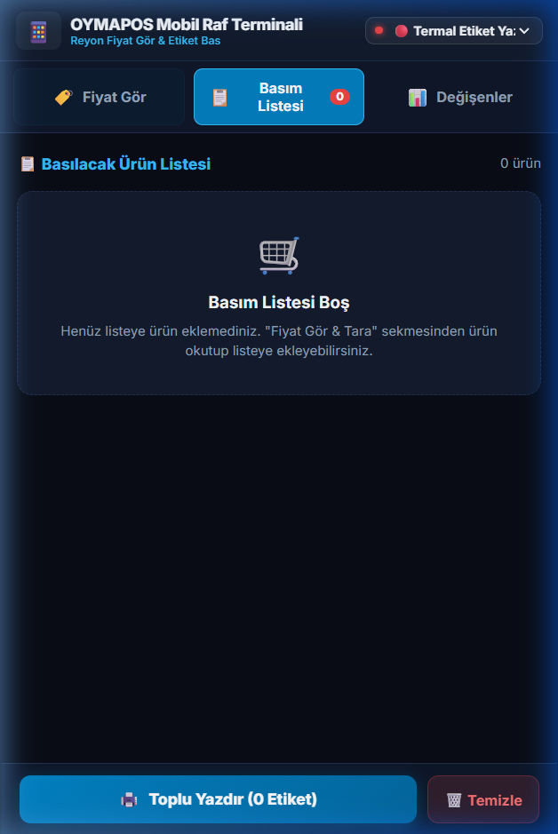
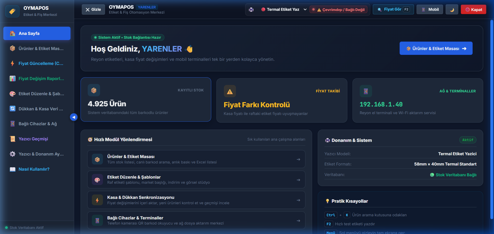
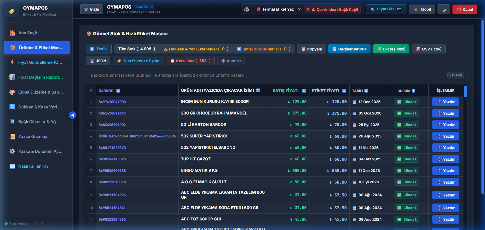
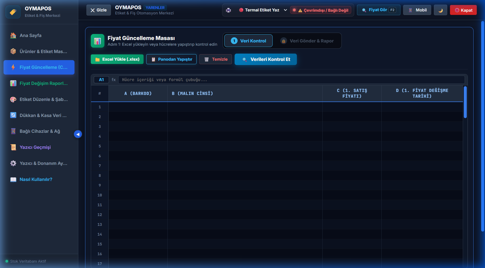

# 🏷️ OYMAPOS - Kurumsal Etiket & Fiş Otomasyon Merkezi

**OYMAPOS**, süpermarketler, şarküteriler, manavlar ve perakende satış noktaları için geliştirilmiş; bağımsız, yüksek performanslı ve modern bir **Etiket ve Fiş Baskı Kontrol Merkezi**dir.

Herhangi bir özel POS veya ERP yazılımına bağımlı kalmadan; panodan kopyalanan listeleri, Excel/CSV dosyalarını, kasa verilerini veya barkod tarayıcı girişlerini **akıllı barkod algılama motoru** sayesinde otomatik ayrıştırır. Masaüstü yönetim paneli, reyon el terminali (mobil telefon kamerası) veya barkod okuyucu aracılığıyla tek tıkla termal / lazer yazıcılardan standartlara uygun etiket basılmasını sağlar.

---

## 📱 Mobil Reyon Terminali (Telefon ile Kablosuz Denetim)

Akıllı telefonunuzu herhangi bir uygulama yüklemeden reyon el terminaline dönüştürün. Kamera ile barkod okutma, anlık ürün sorgulama, fiyat değiştirme ve kasadaki yazıcıya tek tıkla yazdırma imkanı sunar.

| Ekran Önizlemesi | Modül & Özellik Açıklaması |
| :--- | :--- |
|  | ### 1. 🏷️ Fiyat Gör & Ürün Detay Kartı<br><br>• **Anlık Kamera & Lazer Tarama:** Telefon kamerası lazer okuyucu hassasiyetinde barkodu anında yakalar.<br>• **Kasa & Etiket Karşılaştırması:** Kasadaki güncel satış fiyatı ile basılı raf etiketi fiyatını yan yana gösterir.<br>• **Telefondan Fiyat Güncelleme:** Reyonda gezerken tek tıkla yeni fiyat girilip sisteme kaydedilebilir.<br>• **Piyasa Radarı:** Ürünün zincir marketlerdeki anlık fiyatlarıyla kıyaslamasını listeler. |
|  | ### 2. 📋 Kablosuz Basım Kuyruğu<br><br>• **Ters Kronolojik Sıralama:** Okutulan son ürün daima en üstte listelenir.<br>• **Kasadaki Yazıcıya Gönder:** Reyonda toplanan etiket listesi tek dokunuşla kasadaki termal yazıcıya iletilir.<br>• **Adet & Fiyat Kontrolü:** Yazdırma öncesinde etiket adedi veya fiyatı reyon üzerinden revize edilebilir. |
|  | ### 3. 📊 Günlük Değişenler & Döküm<br><br>• **Günün Değişen Fiyatları:** O gün fiyatı değişen tüm ürünler zam/indirim oranlarıyla listelenir.<br>• **Ekrandan Barkod Okutma:** Reyon görevlisinin masaüstü veya el tipi okuyucu ile tarayabilmesi için ekranda büyük barkod açar.<br>• **Mobil PDF İndirme:** Günlük değişim raporunu telefona PDF formatında indirir. |

---

## 🖥️ Masaüstü Yönetim Masası & Temel Paneller

OYMAPOS Masaüstü Arayüzü, yoğun market temposunda hızlı işlem yapabilmek için klavye odaklı, sade ve güçlü araçlarla donatılmıştır.

| Ekran Önizlemesi | Modül & Özellik Açıklaması |
| :--- | :--- |
|  | ### 🏠 Ana Kontrol Paneli (Dashboard)<br><br>• **Genel Durum Özeti:** Toplam stok (4.908 ürün), fiyat farkı olan ürünler ve sistem sağlık durumu.<br>• **Canlı Yazıcı Takibi:** Seçili termal yazıcının bağlantı ve hazır olma durumunu anlık gösterir.<br>• **Hızlı Modül Kısayolları:** Tek tıkla ürün masasına, aktarıma veya stüdyoya geçiş. |
|  | ### 📦 Ürünler & Hızlı Etiket Masası (Excel Grid)<br><br>• **Hızlı Arama & Filtre:** İsim veya barkodla anında filtreleme.<br>• **Fiyat Tutarsızlık Alarmı:** Kasada fiyatı düşük, etikette yüksek olan ürünler için akıllı uyarı.<br>• **Çoklu Seçim:** `Shift + Tık` (Aralık) ve `Ctrl + Tık` (Tek tek) ile toplu etiket yazdırma.<br>• **Satışı Durdurulanlar (Pasif):** Silinmeyen, yeni fiyat geldiğinde otomatik aktife dönen pasif ürün yönetimi. |
|  | ### ⚡ Fiyat Güncelleme Masası (Ctrl+V & Excel)<br><br>• **Panodan Doğrudan Yapıştırma (Ctrl + V):** Muhasebe programından kopyalanan satırları saniyeler içinde içeri aktarır.<br>• **Renk Kodlu Güvenli Karşılaştırma:** Zam gelenler, indirim yapılanlar ve yeni ürünler onay öncesinde listelenir.<br>• **Geri Alma (Rollback / Undo):** Hatalı aktarımlarda tek tıkla önceki fiyatlara anında dönüş. |
|  | ### 📊 Günlük Değişim Raporları & A4 Barkod PDF<br><br>• **Kaynak Bazlı Filtreleme:** Mobil terminal, masaüstü veya toplu aktarım kaynaklarına göre filtreleme.<br>• **A4 Büyük Barkodlu PDF:** Reyonda gezerek okutulabilecek A4 boyutunda büyük barkodlu döküm.<br>• **Etiketleri Otomatik Eşitle:** Baskı alındıktan sonra tek tıkla raf etiket fiyatlarını satış fiyatına eşitler. |
|  | ### 🎨 Etiket Tasarım Stüdyosu & Şablonlar<br><br>• **Standart Ebatlar:** 76x40 mm (Standart Market Rafı), 60x40 mm (Kompakt), 40x20 mm.<br>• **Yasal Ögeler:** Resmi Yerli Üretim Logosu, 1 KG/1 LT Birim Fiyat Kutusu ve Reyon Kodu.<br>• **Canlı Önizleme:** Yazıcıya göndermeden önce birebir etiket çıktısını ekranda görme imkanı. |

---

## ⌨️ Klavye Kısayolları

| Kısayol | Açıklama |
| :--- | :--- |
| **`F2`** | Hızlı Fiyat Gör & Barkod / Stok Sorgulama penceresini açar. |
| **`Shift + Tık`** | Ürün tablosunda seçilen iki ürün arasındaki tüm satırları seçer (Aralık Seçimi). |
| **`Ctrl + Tık`** | Ürün tablosunda istenen ürünleri tek tek çoklu seçime ekler/çıkarır. |
| **`Ctrl + K`** | Doğrudan ürün arama çubuğuna odaklanır. |
| **`ESC`** | Açık olan önizleme, düzenleme ve arama pencerelerini kapatır. |

---

## 🚀 Kurulum ve Başlatma

### 1. Tek Tıkla Başlatma (Tavsiye Edilen)
Proje ana dizinindeki **`BASLAT.bat`** dosyasına çift tıklayın. Sistem Python ortamını ve bağımlılıkları kontrol ederek sunucuyu otomatik başlatır.

### 2. Manuel Başlatma (Geliştirici Modu)
```bash
# Gerekli kütüphaneleri yükleyin
pip install -r requirements.txt

# Sunucuyu başlatın
python main.py
```
Tarayıcınızda arayüz `http://localhost:8000` adresinde açılacaktır.

---

## 🌐 Ağ ve Cihaz Portalı

| Modül | Yerel Adres | Açıklama |
| :--- | :--- | :--- |
| 🖥️ **Masaüstü Kontrol Merkezi** | `http://localhost:8000/` | Ürünler, şablonlar, fiyat değişimi ve raporlama masası. |
| 💻 **Veri Aktarım Masası** | `http://[IP_ADRESI]:8000/sync` | Yerel ağdaki diğer bilgisayarlardan dosya ve pano aktarımı. |
| 📱 **Reyon Mobil Terminali** | `http://[IP_ADRESI]:8000/mobile` | Telefon kamerasıyla kablosuz reyon denetimi ve anlık etiket basımı. |
