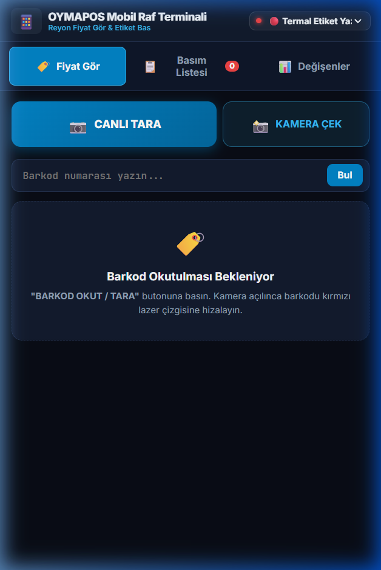

# 🏷️ OYMAPOS - Kurumsal Etiket & Fiş Otomasyon Merkezi

**OYMAPOS**, süpermarketler, şarküteriler, manavlar ve perakende satış noktaları için geliştirilmiş; bağımsız, yüksek performanslı ve modern bir **Etiket ve Fiş Baskı Kontrol Merkezi**dir.

Herhangi bir özel POS veya ERP yazılımına bağımlı kalmadan; panodan kopyalanan listeleri, Excel/CSV dosyalarını, kasa verilerini veya barkod tarayıcı girişlerini **akıllı barkod algılama motoru** sayesinde otomatik ayrıştırır. Masaüstü yönetim paneli, reyon el terminali (mobil telefon kamerası) veya barkod okuyucu aracılığıyla tek tıkla termal / lazer yazıcılardan standartlara uygun etiket basılmasını sağlar.

---

## 📸 Ekran Görüntüleri & Arayüz Önizlemesi

| 🖥️ Masaüstü Kontrol Merkezi & Ürün Masası | 📱 Mobil Reyon Asistanı (Telefon Terminali) |
| :---: | :---: |
|  |  |

| 📊 Ana Kontrol Paneli (Dashboard) |
| :---: |
|  |

---

## 📖 Sistem Panelleri ve Kullanım Kılavuzu

### 1. 📦 Ürünler & Etiket Masası
* **Arama & Filtreleme:** Ürün adı, barkod veya reyon kodu ile anında filtreleme.
* **Ürün Detay Kartı:** Listede bir ürüne 1 kez tıklandığında ürünün detayları, fiyat geçmişi ve etiket önizlemesi görüntülenir.
* **Hızlı Düzenleme:** Ürüne çift tıklandığında ürün adı, satış fiyatı, birim miktarı ve KDV oranı doğrudan düzenlenebilir.
* **Çoklu Seçim:** `Shift + Tık` ile aralık seçimi, `Ctrl + Tık` ile bağımsız çoklu ürün seçimi yapılabilir.
* **Fiyat Farkı Takibi:** "⚠️ Fiyatı Değişenler" filtresiyle, kasadaki güncel fiyatı ile basılı raf etiketi uyuşmayan ürünler tek tıkla listelenir.
* **Kara Liste Filtresi:** Poşet, depozito vb. etiket basılmayacak ürünler tek tıkla gizlenir veya yönetilir.

### 2. ⚡ Fiyat Güncelleme (Ctrl+V & Excel Masası)
* **Panodan Doğrudan Yapıştırma (Ctrl + V):** Muhasebe programından veya Excel'den kopyalanan satırları doğrudan yapıştırarak saniyeler içinde içeri aktarma.
* **Excel / CSV Yükleme:** Sürükle-bırak yöntemiyle dosya yükleme desteği.
* **2 Aşamalı Güvenli Karşılaştırma Masası:** Zam gelenler, indirim yapılanlar ve yeni ürünler onay öncesinde renk kodlarıyla gösterilir.
* **Geri Alma (Rollback / Undo):** İstenmeyen aktarımlarda tek tıkla önceki fiyatlara anında dönebilme.

### 3. 📊 Fiyat Değişim Raporları & PDF Baskı
* **Günlük ve Kaynak Bazlı Takip:** Mobil terminalden, masaüstünden veya toplu aktarımdan gelen fiyat değişimleri ayrı ayrı filtrelenir.
* **A4 Büyük Barkodlu Değişim Raporu:** Reyon görevlisinin reyonda gezerken el tipi okuyucu veya telefonla okutabileceği büyük barkodlu A4 PDF dökümü oluşturulur.
* **Otomatik Etiket Fiyatı Eşitleme:** PDF basıldıktan sonra sistem onay ister ve ürünlerin raf etiket fiyatları otomatik olarak güncellenir.

### 4. 🎨 Etiket Düzenle & Şablonlar (Stüdyo)
* **Hazır Standart Boyutlar:** 76x40 mm (Standart Market Rafı), 60x40 mm (Kompakt), 40x20 mm ve özel ebatlar.
* **Yasal Ögeler:** Resmi Yerli Üretim Logosu, Birim Fiyat Kutusu (1 KG / 1 LT), Gramaj/Miktar Rozeti, Reyon Kodu ve QR Kod desteği.
* **Görsel Tasarım Masası:** Ögelerin yerleşimi canlı önizleme üzerinden anında kontrol edilir.

### 5. 🔄 Dükkan & Kasa Veri Aktarımı
* **Otomatik Dosya İzleme:** Kasa programının ürettiği `fiyat.xlsx` veya `urunler.csv` dosyası güncellendiğinde sistem fiyatları otomatik algılar.
* **Yerel Ağ Senkronizasyonu:** Dükkandaki diğer bilgisayarlardan `http://[IP]:8000/sync` adresi üzerinden veri aktarımı.
* **Terazi & Manav Barkodu:** 27, 28 ve 29 ile başlayan gramajlı ve tutarlı terazi barkodlarını otomatik ayrıştırma.

### 6. 📱 Mobil Barkod Terminali (Reyon Asistanı)
* **Uygulamasız Kullanım:** Tarayıcı üzerinden `http://[IP]:8000/mobile` adresine girilerek telefon kamerası lazer barkod okuyucuya dönüştürülür.
* **Telefondan Fiyat Değiştirme:** Reyonda gezerken barkodu okutup tek tıkla yeni fiyat girilebilir.
* **Ters Kronolojik Basım Listesi:** En son okutulan ürün daima en üstte listelenir, böylece reyon görevlisi işlemlerini anlık takip edebilir.
* **Kasaya Gönder:** Telefondan seçilen etiketler kasadaki termal yazıcıya doğrudan kablosuz iletilir.

### 7. ⚙️ Yazıcı & Donanım Ayarları
* **Termal Yazıcı Yönetimi:** Xprinter, Zebra, Argox, HPRT, Bixolon vb. tüm yazıcılarla doğrudan Windows RAW Spooler (ZPL / TSPL) entegrasyonu.
* **Baskı Kalibrasyonu:** Koyuluk (Darkness) ve yatay/dikey ofset kaydırma ayarları.
* **Tek Tıkla Yedekleme:** Veritabanı ve ayarları `.zip` formatında dışa aktarma ve geri yükleme.

---

## ⌨️ Klavye Kısayolları

| Kısayol | Açıklama |
| :--- | :--- |
| **`F2`** | Hızlı Fiyat Gör & Barkod / Stok Sorgulama modalını açar. |
| **`Shift + Tık`** | Ürün tablosunda seçilen iki ürün arasındaki tüm satırları seçer (Aralık Seçimi). |
| **`Ctrl + Tık`** | Ürün tablosunda istenen ürünleri tek tek seçime ekler/çıkarır. |
| **`ESC`** | Açık olan önizleme, düzenleme ve arama modallarını kapatır. |

---

## 🚀 Kurulum ve Başlatma

### 1. Tek Tıkla Başlatma (Tavsiye Edilen)
Proje ana dizinindeki **`BASLAT.bat`** dosyasına çift tıklayın. Sistem ortamı otomatik hazırlar ve tarayıcıyı açar.

### 2. Manuel Başlatma (Geliştirici Modu)
```bash
# Gerekli kütüphaneleri yükleyin
pip install -r requirements.txt

# Sunucuyu başlatın
python main.py
```
Tarayıcınızda arayüz `http://localhost:8000` adresinde açılacaktır.

---

## 🌐 Ağ ve Cihaz Portalı

| Modül | Yerel Adres | Açıklama |
| :--- | :--- | :--- |
| 🖥️ **Masaüstü Kontrol Merkezi** | `http://localhost:8000/` | Ürünler, şablonlar, fiyat değişimi ve raporlar. |
| 💻 **Veri Aktarım Masası** | `http://[IP_ADRESI]:8000/sync` | Ağdaki diğer bilgisayarlardan dosya/pano aktarımı. |
| 📱 **Reyon Mobil Terminali** | `http://[IP_ADRESI]:8000/mobile` | Telefon kamerasıyla kablosuz reyon denetimi ve etiket basımı. |
