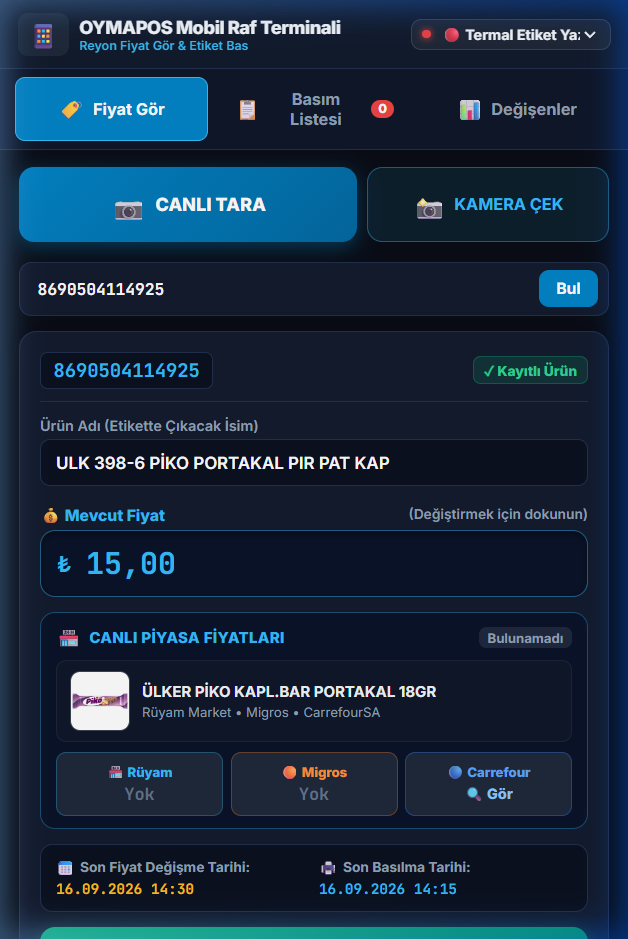
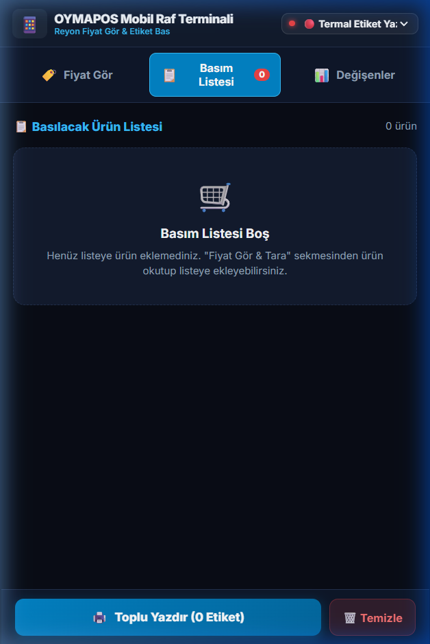
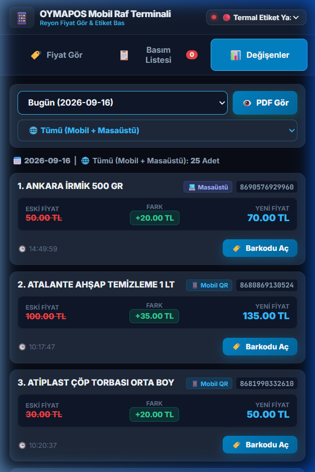
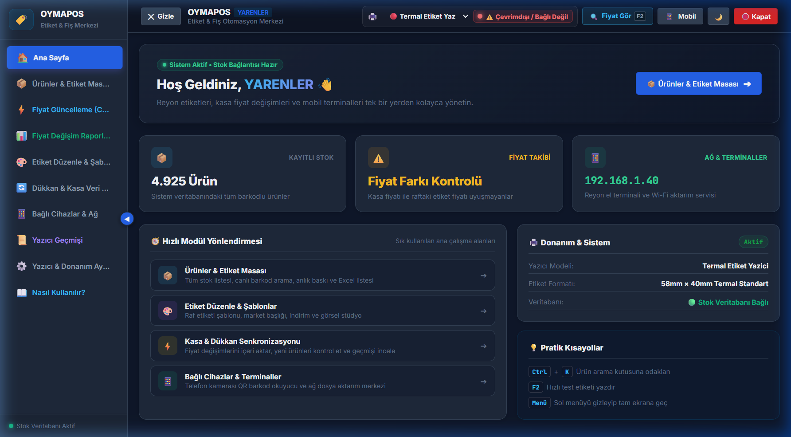
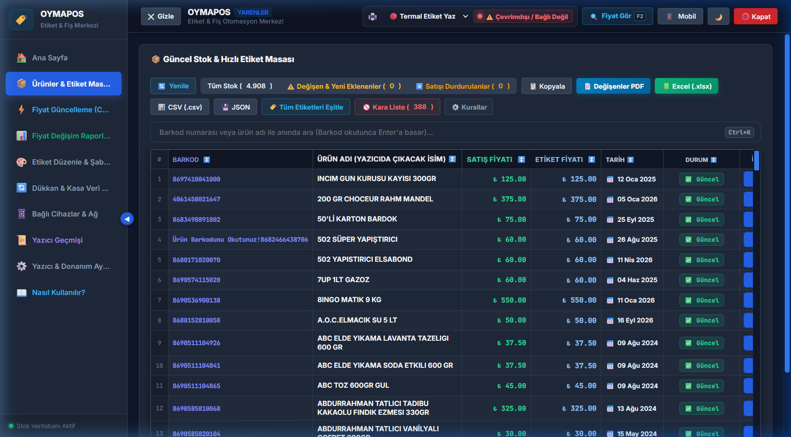
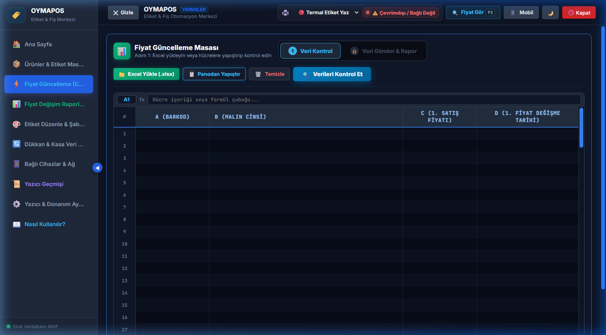
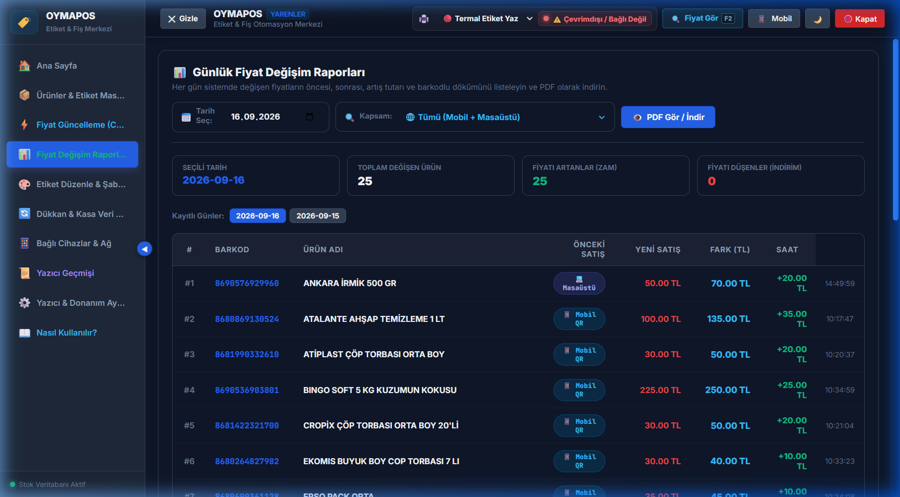
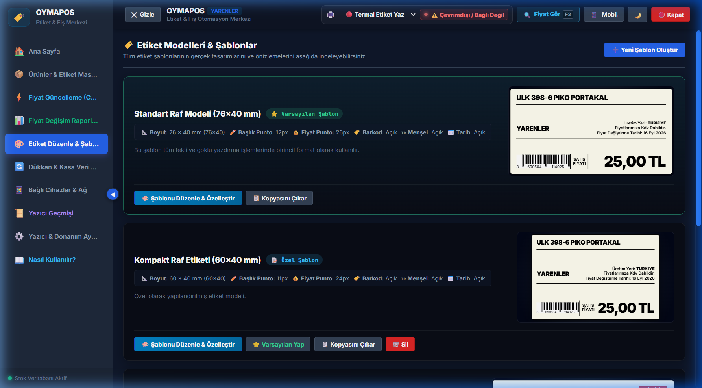

# 🏷️ OYMAPOS - Kurumsal Etiket & Fiş Otomasyon Merkezi

**OYMAPOS**, süpermarketler, şarküteriler, manavlar ve perakende satış noktaları için geliştirilmiş; bağımsız, yüksek performanslı ve modern bir **Etiket ve Fiş Baskı Kontrol Merkezi**dir.

Herhangi bir özel POS veya ERP yazılımına bağımlı kalmadan; panodan kopyalanan listeleri, Excel/CSV dosyalarını, kasa verilerini veya barkod tarayıcı girişlerini **akıllı barkod algılama motoru** sayesinde otomatik ayrıştırır. Masaüstü yönetim paneli, reyon el terminali (mobil telefon kamerası) veya barkod okuyucu aracılığıyla tek tıkla termal / lazer yazıcılardan standartlara uygun etiket basılmasını sağlar.

---

## 🚀 Öne Çıkan Temel Yetenekler

- 📦 **Geniş Stok Yönetimi:** 4.900+ ürünü anlık arama, `Shift + Tık` ile aralık seçimi ve toplu etiket yazdırma.
- 📱 **Mobil Reyon Terminali:** Uygulama yüklemeden telefon kamerasını lazer barkod okuyucuya dönüştürerek reyonda anında fiyat kontrolü ve etiket basımı.
- ⚡ **Ctrl+V ile Saniyeler İçinde Güncelleme:** Muhasebe programı veya Excel'den kopyalanan listeleri doğrudan yapıştırarak 2 aşamalı renk kodlu kontrolle aktarma.
- ⚠️ **Akıllı Fiyat Tutarsızlık Koruması:** Kasadaki satış fiyatı basılı etiket fiyatından düşükse sistemi uyararak hatalı basımı engelleme.
- 📊 **Günlük Değişim Raporları & A4 Barkod PDF:** Gün içinde değişen fiyatların dökümünü alma ve reyonda el terminaliyle taranabilen büyük barkodlu A4 PDF çıktısı.
- 🎨 **Canlı Tasarım Stüdyosu:** 76x40mm ve 60x40mm standart market şablonları, resmi Yerli Üretim Logosu ve 1 KG / 1 LT birim fiyat kutusu desteği.
- 🔄 **Dükkan & Ağ Senkronizasyonu:** Yerel ağdaki diğer bilgisayarlardan (`/sync`) doğrudan veri aktarımı ve terazi/manav barkodu ayrıştırma.

---

## 📖 Sistem Panelleri ve Kullanım Kılavuzu

### 1. 📦 Ürünler & Etiket Masası
* **Canlı Arama & Filtreleme:** Ürün adı, barkod veya reyon kodu yazıldığı anda sonuçlar milisaniyeler içinde filtrelenir.
* **Fiyat Farkı Alarmı:** Kasadaki satış fiyatı ile basılı raf etiketi uyuşmayan veya fiyatı düşüp kasada düzeltilmemiş ürünler tek tıkla süzülür.
* **Hızlı Düzenleme & Geçmiş:** Ürüne çift tıklandığında adı, satış fiyatı, birim miktarı düzenlenebilir; tek tıkla fiyat değişim geçmişi incelenebilir.
* **Toplu Seçim & Yazdırma:** `Shift + Tık` (aralık seçimi) ve `Ctrl + Tık` (bağımsız çoklu seçim) ile binlerce etiket tek tıkla canlı ilerleme çubuğuyla yazıcıya gönderilir.
* **Satışı Durdurulanlar (Pasif Ürünler):** Artık satılmayan ürünler silinmez, pasife alınır. Yeni bir fiyat aktarımı yapıldığında otomatik aktife döner.

### 2. ⚡ Fiyat Güncelleme Masası (Ctrl+V & Excel)
* **Panodan Yapıştırma (Ctrl + V):** Muhasebe programından (VegaWin vb.) veya Excel'den kopyalanan satırlar doğrudan yapıştırılır.
* **2 Aşamalı Güvenlik Masası:** Zam gelenler, indirim yapılanlar ve yeni ürünler onay öncesinde renk kodlarıyla gösterilir.
* **Geri Alma (Rollback / Undo):** Hatalı veya yanlış girilen aktarımlarda tek tıkla önceki fiyatlara anında dönülür.

### 3. 📊 Fiyat Değişim Raporları & PDF Baskı
* **Kaynak Bazlı Filtreleme:** Mobil terminalden, masaüstünden veya toplu aktarımdan gelen fiyat değişimleri ayrı ayrı incelenir.
* **A4 Büyük Barkodlu Değişim Raporu:** Reyon görevlisinin reyonda gezerken lazer okuyucu veya telefonla okutabileceği A4 dökümü oluşturulur.
* **Otomatik Etiket Fiyatı Eşitleme:** Baskı tamamlandıktan sonra sistem onay ister ve raf etiket fiyatları güncel fiyata eşitlenir.

### 4. 🎨 Etiket Düzenle & Şablonlar (Stüdyo)
* **Standart Boyutlar:** 76x40 mm (Standart Market Rafı), 60x40 mm (Kompakt), 40x20 mm ve özel ölçüler.
* **Yasal Ögeler:** Resmi Yerli Üretim Logosu, Birim Fiyat Kutusu (1 KG / 1 LT), Gramaj/Miktar Rozeti, Reyon Kodu ve QR Kod desteği.
* **Görsel Tasarım Masası:** Ögelerin yerleşimi canlı etiket çıktısı üzerinden anında kontrol edilir.

### 5. 🔄 Dükkan & Kasa Veri Aktarımı
* **Otomatik Dosya İzleme:** Kasa programının ürettiği `fiyat.xlsx` veya `urunler.csv` dosyası güncellendiğinde sistem fiyatları otomatik algılar.
* **Yerel Ağ Senkronizasyonu:** Dükkandaki diğer bilgisayarlardan `http://[IP]:8000/sync` adresi üzerinden veri aktarımı.
* **Terazi & Manav Barkodu:** 27, 28 ve 29 ile başlayan gramajlı ve tutarlı terazi barkodlarını otomatik ayrıştırma.

### 6. 📱 Mobil Barkod Terminali (Reyon Asistanı)
* **Uygulamasız Kullanım:** Tarayıcı üzerinden `http://[IP]:8000/mobile` adresine girilerek telefon kamerası lazer barkod okuyucuya dönüştürülür.
* **Telefondan Fiyat Değiştirme:** Reyonda gezerken barkodu okutup tek tıkla yeni fiyat girilebilir.
* **Ters Kronolojik Basım Listesi:** En son okutulan ürün daima en üstte listelenir, böylece reyon görevlisi işlemlerini anlık takip edebilir.
* **Kasaya Gönder:** Telefondan seçilen etiketler kasadaki termal yazıcıya doğrudan kablosuz iletilir.

### 7. ⚙️ Yazıcı & Donanım Ayarları
* **Termal Yazıcı Yönetimi:** Xprinter, Zebra, Argox, HPRT, Bixolon vb. tüm yazıcılarla doğrudan Windows RAW Spooler (ZPL / TSPL) entegrasyonu.
* **Baskı Kalibrasyonu:** Koyuluk (Darkness) ve yatay/dikey ofset kaydırma ayarları.
* **Tek Tıkla Yedekleme:** Veritabanı ve ayarları `.zip` formatında dışa aktarma ve geri yükleme.

---

## ⌨️ Klavye Kısayolları

| Kısayol | Açıklama |
| :--- | :--- |
| **`F2`** | Hızlı Fiyat Gör & Barkod / Stok Sorgulama penceresini açar. |
| **`Shift + Tık`** | Ürün tablosunda seçilen iki ürün arasındaki tüm satırları seçer (Aralık Seçimi). |
| **`Ctrl + Tık`** | Ürün tablosunda istenen ürünleri tek tek çoklu seçime ekler/çıkarır. |
| **`Ctrl + K`** | Doğrudan ürün arama çubuğuna odaklanır. |
| **`ESC`** | Açık olan önizleme, düzenleme ve arama pencerelerini kapatır. |

---

## 🚀 Kurulum ve Başlatma

### 1. Tek Tıkla Başlatma (Tavsiye Edilen)
Proje ana dizinindeki **`BASLAT.bat`** dosyasına çift tıklayın. Sistem Python ortamını ve bağımlılıkları kontrol ederek sunucuyu otomatik başlatır.

### 2. Manuel Başlatma (Geliştirici Modu)
```bash
# Gerekli kütüphaneleri yükleyin
pip install -r requirements.txt

# Sunucuyu başlatın
python main.py
```
Tarayıcınızda arayüz `http://localhost:8000` adresinde açılacaktır.

---

## 🌐 Ağ ve Cihaz Portalı

| Modül | Yerel Adres | Açıklama |
| :--- | :--- | :--- |
| 🖥️ **Masaüstü Kontrol Merkezi** | `http://localhost:8000/` | Ürünler, şablonlar, fiyat değişimi ve raporlama masası. |
| 💻 **Veri Aktarım Masası** | `http://[IP_ADRESI]:8000/sync` | Yerel ağdaki diğer bilgisayarlardan dosya ve pano aktarımı. |
| 📱 **Reyon Mobil Terminali** | `http://[IP_ADRESI]:8000/mobile` | Telefon kamerasıyla kablosuz reyon denetimi ve anlık etiket basımı. |

---

## 📸 Ekran Görüntüleri ve Görsel Panel Galerisi

### 📱 1. Mobil Reyon Terminali (Telefon Arayüzü)

| Ekran Önizlemesi | Modül & Özellik Açıklaması |
| :--- | :--- |
|  | ### 🏷️ Fiyat Gör & Ürün Detay Kartı<br><br>• **Anlık Kamera & Lazer Tarama:** Telefon kamerası lazer okuyucu hassasiyetinde barkodu anında yakalar.<br>• **Kasa & Etiket Karşılaştırması:** Kasadaki güncel satış fiyatı ile basılı raf etiketi fiyatını yan yana gösterir.<br>• **Telefondan Fiyat Güncelleme:** Reyonda gezerken tek tıkla yeni fiyat girilip sisteme kaydedilebilir.<br>• **Piyasa Radarı:** Ürünün zincir marketlerdeki anlık fiyatlarıyla kıyaslamasını listeler. |
|  | ### 📋 Kablosuz Basım Kuyruğu<br><br>• **Ters Kronolojik Sıralama:** Okutulan son ürün daima en üstte listelenir.<br>• **Kasadaki Yazıcıya Gönder:** Reyonda toplanan etiket listesi tek dokunuşla kasadaki termal yazıcıya iletilir.<br>• **Adet & Fiyat Kontrolü:** Yazdırma öncesinde etiket adedi veya fiyatı reyon üzerinden revize edilebilir. |
|  | ### 📊 Günlük Değişenler & Döküm<br><br>• **Günün Değişen Fiyatları:** O gün fiyatı değişen tüm ürünler zam/indirim oranlarıyla listelenir.<br>• **Ekrandan Barkod Okutma:** Reyon görevlisinin masaüstü veya el tipi okuyucu ile tarayabilmesi için ekranda büyük barkod açar.<br>• **Mobil PDF İndirme:** Günlük değişim raporunu telefona PDF formatında indirir. |

---

### 🖥️ 2. Masaüstü Kontrol Masası Panelleri

| Ekran Önizlemesi | Modül & Özellik Açıklaması |
| :--- | :--- |
|  | ### 🏠 Ana Kontrol Paneli (Dashboard)<br><br>• **Genel Durum Özeti:** Toplam stok (4.925 ürün), fiyat farkı olan ürünler ve sistem sağlık durumu.<br>• **Canlı Yazıcı Takibi:** Seçili termal yazıcının bağlantı ve hazır olma durumunu anlık gösterir.<br>• **Hızlı Modül Kısayolları:** Tek tıkla ürün masasına, aktarıma veya stüdyoya geçiş. |
|  | ### 📦 Ürünler & Hızlı Etiket Masası (Excel Grid)<br><br>• **Hızlı Arama & Filtre:** İsim veya barkodla anında filtreleme.<br>• **Fiyat Tutarsızlık Alarmı:** Kasada fiyatı düşük, etikette yüksek olan ürünler için akıllı uyarı.<br>• **Çoklu Seçim:** `Shift + Tık` (Aralık) ve `Ctrl + Tık` (Tek tek) ile toplu etiket yazdırma.<br>• **Satışı Durdurulanlar (Pasif):** Silinmeyen, yeni fiyat geldiğinde otomatik aktife dönen pasif ürün yönetimi. |
|  | ### ⚡ Fiyat Güncelleme Masası (Ctrl+V & Excel)<br><br>• **Panodan Doğrudan Yapıştırma (Ctrl + V):** Muhasebe programından kopyalanan satırları saniyeler içinde içeri aktarır.<br>• **Renk Kodlu Güvenli Karşılaştırma:** Zam gelenler, indirim yapılanlar ve yeni ürünler onay öncesinde listelenir.<br>• **Geri Alma (Rollback / Undo):** Hatalı aktarımlarda tek tıkla önceki fiyatlara anında dönüş. |
|  | ### 📊 Günlük Değişim Raporları & A4 Barkod PDF<br><br>• **Kaynak Bazlı Filtreleme:** Mobil terminal, masaüstü veya toplu aktarım kaynaklarına göre filtreleme.<br>• **A4 Büyük Barkodlu PDF:** Reyonda gezerek okutulabilecek A4 boyutunda büyük barkodlu döküm.<br>• **Etiketleri Otomatik Eşitle:** Baskı alındıktan sonra tek tıkla raf etiket fiyatlarını satış fiyatına eşitler. |
|  | ### 🎨 Etiket Tasarım Stüdyosu & Şablonlar<br><br>• **Standart Ebatlar:** 76x40 mm (Standart Market Rafı), 60x40 mm (Kompakt), 40x20 mm.<br>• **Yasal Ögeler:** Resmi Yerli Üretim Logosu, 1 KG/1 LT Birim Fiyat Kutusu ve Reyon Kodu.<br>• **Canlı Önizleme:** Yazıcıya göndermeden önce birebir etiket çıktısını ekranda görme imkanı. |
